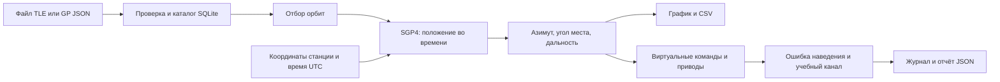

# Приморец — автономный орбитальный планировщик

Первый прототип настольной программы на Python 3.9+ / Tkinter, Skyfield и SQLite.
Работает с локальными файлами, не обращается к сети во время работы и не подключается к приводам.
Предназначен для отбора орбит и расчёта геометрических направлений на спутники.

## Возможности

- Импорт TLE (две строки или имя и две строки), GP JSON / OMM JSON для Earth/TEME/UTC/SGP4.
- Локальная SQLite: обновление по идентификатору и эпохе; более старые элементы не заменяют свежие.
- Отбор по минимальному эксцентриситету, приблизительной высоте апогея и диапазону периода.
- Координаты наблюдателя WGS84, маска горизонта, время UTC, интервал до 7 суток и шаг расчёта.
- Расчёт азимута от севера по часовой стрелке, угла места и наклонной дальности.
- График угла места; CSV с точками, названием спутника, источником элементов, эпохой и параметрами станции.
- Сохранение настроек. Учебные записи отделены от настоящих собственным пространством идентификаторов.
- В сеансе: мощность приёма по Фриису с текущей наклонной дальностью, коэффициент распространения, потери FSPL и запас относительно порога.

Начальные критерии `e ≥ 0.25`, апогей `≥ 20000 км`, период `0…48 ч` — рабочие настройки прототипа,
а не формальное определение ВЭО. Пригодность для радиосвязи (диапазон, полезная нагрузка,
эксплуатационный статус, доступ к транспондеру) этим фильтром не устанавливается.

## Как объяснить работу программы

Программа состоит из двух последовательных частей: **орбитального планировщика** и
**учебного имитатора сеанса**. Планировщик вычисляет положение спутника по орбитальным
элементам. Имитатор воспроизводит движение условной антенны по полученной траектории,
проверяет точность наведения и включает счётчик учебных пакетов при выполнении условий захвата.



### Какие файлы за что отвечают

| Файл | Ответственность | Основные объекты / функции |
|---|---|---|
| `primorets/core.py` | Проверка элементов, параметры орбит, направления на спутник, CSV | `Record`, `parse_file`, `validate`, `OrbitFilter`, `Station`, `trajectory`, `export_csv` |
| `primorets/catalog.py` | Хранение и обновление спутников на диске | `Catalog.import_records`, `Catalog.all`, `default_data_dir` |
| `primorets/gui.py` | Главное окно, ввод параметров, таблица, запуск расчёта и график | `App`, `calculate`, `poll`, `draw`, `open_session` |
| `primorets/session.py` | Модель времени, команд, приводов, захвата и пакетов | `Session`, `target`, `advance`, `error`, `state` |
| `primorets/radio.py` | Расчёт мощности приёма, потерь и запаса по текущей дальности | `RadioSettings`, `at_range` |
| `primorets/session_gui.py` | Отдельное окно сеанса и визуализация обратной связи | `SessionWindow`, `tick`, `render`, `draw`, `save` |
| `primorets/__main__.py` | Вход при запуске `python -m primorets` | Вызов `gui.main` |
| `requirements.txt` | Библиотека расчёта и её фиксированная версия | `skyfield==1.54` |
| `pyproject.toml` | Описание Python-пакета и команды запуска | Имя пакета, версия, зависимости, команда `primorets` |
| `run-windows.cmd`, `run-linux.sh` | Запуск из локального виртуального окружения | Передают `--data-dir ./data` |
| `tests/test_core.py` | Проверки орбитального расчёта и базы | Включая эталон SGP4 и независимую проверку местных углов |
| `tests/test_session.py` | Проверки имитации | Захват, потеря видимости, отказ, остановка и восстановление |
| `tests/test_radio.py` | Проверки Фрииса и влияния дальности на сеанс | Контрольные значения, закон 1/R², потеря и восстановление канала |
| `tests/gui_smoke.py` | Проверка взаимодействия реальных виджетов | Скрытое окно, расчёт, график, сеанс, экспорт |

Skyfield отвечает за астрономические системы координат и работу со временем; его зависимость
`sgp4` — за распространение орбитальных элементов. NumPy обрабатывает массивы точек.
SQLite и Tkinter входят в стандартную библиотеку Python; для Tkinter также необходим Tcl/Tk.

### 1. Откуда берутся орбиты и как они проверяются

TLE — фиксированный формат из двух строк; перед ними может стоять имя спутника.
Программа проверяет длину строк (69 символов), номера строк, совпадение идентификатора
и контрольную сумму. Сумма вычисляется по первым 68 символам: цифры дают своё значение,
минус даёт 1, остальные символы — 0; остаток по модулю 10 должен совпасть с последним символом.

GP JSON передаёт те же типы средних орбитальных элементов именованными полями.
Используются `EPOCH`, `MEAN_MOTION`, `ECCENTRICITY`, `INCLINATION`,
`RA_OF_ASC_NODE`, `ARG_OF_PERICENTER`, `MEAN_ANOMALY` и служебные поля SGP4.
Поддерживаются Земля, система TEME, время UTC и теория SGP4. Отсутствующие метаданные этих
типов дополняются значениями, принятыми для CelesTrak GP JSON; явно другие значения отклоняются.

`validate` проверяет конечность основных чисел, `0 ≤ e < 1`, допустимое наклонение,
положительное среднее движение и возможность вычислить положение на эпоху элементов.
Это проверка пригодности данных для расчёта, а не проверка реального существования или рабочего состояния спутника.
Весь файл проверяется до изменения базы.

В SQLite одна запись соответствует одному идентификатору в пространстве `real` или `demo`.
Сохраняются имя, исходные элементы, название файла-источника, признак учебных данных, эпоха
и время импорта. Новый файл обновляет запись только при более поздней эпохе. Одинаковые
и более старые элементы пропускаются. История всех наборов элементов не архивируется автоматически.

### 2. Как работают фильтры орбит

| Поле | Физический смысл и единицы | Проверка / действие |
|---|---|---|
| Эксцентриситет `e` | Безразмерная вытянутость орбиты; 0 соответствует круговой | Показываются записи с `e ≥` заданного значения |
| Апогей | Приблизительная максимальная высота над принятой сферой Земли, км | Показываются записи выше нижней границы |
| Период | Время одного оборота, часы | Показываются записи внутри заданного диапазона включительно |
| Наклонение | Угол плоскости орбиты к экваториальной плоскости, градусы | Информационная колонка; отдельного фильтра наклонения пока нет |
| Эпоха UTC | Момент, к которому относятся элементы | Показывается в таблице и используется при предупреждении об устаревании |

Если `n` — среднее движение в радианах в минуту из модели SGP4, то:

```text
T_hours = 2π / n / 60
h_apogee_km ≈ (a · (1 + e) − 1) · R_E
```

Здесь `a` — средняя большая полуось в радиусах Земли, `R_E` — радиус из модели SGP4.
Это описательная оценка по средним элементам, а не поиск максимальной геодезической высоты
по распространённой траектории. Для наблюдателя далее используется эллипсоид WGS84.

### 3. Как рассчитываются азимут, угол места и дальность

Оператор задаёт геодезическую широту, долготу и высоту станции над эллипсоидом WGS84.
Северная широта и восточная долгота положительны. Высота над уровнем моря и высота над
эллипсоидом могут отличаться; программа ожидает вторую.

Временная сетка строится по правилу `t_i = t_start + i · step_seconds`.
Число точек равно `floor(hours · 3600 / step_seconds) + 1`, максимум — 25000.
Ввод без часового пояса трактуется как UTC; явно заданное смещение приводится к UTC.

Для каждого времени Skyfield создаёт положение спутника по SGP4. Для дальних орбит
библиотека выбирает соответствующий режим модели. Программа не заменяет SGP4 простым
движением по неизменному кеплеровскому эллипсу. Положение станции и спутника приводятся
Skyfield к согласованным координатам с учётом вращения Земли, после чего вычитаются:

```text
ρ(t) = r_satellite(t) − r_station(t)
d(t) = |ρ(t)|
```

`d` — наклонная дальность **от станции до спутника**, а не высота спутника над Землёй.
Если выразить вектор `ρ` в местной системе восток–север–вверх `(E, N, U)`, смысл результата такой:

```text
azimuth = atan2(E, N), приведённый к диапазону [0°, 360°)
elevation = atan2(U, sqrt(E² + N²))
range = sqrt(E² + N² + U²)
```

В коде преобразования выполняет `(satellite - observer).at(times).altaz()`.
Азимут отсчитывается от севера по часовой стрелке. Угол места 0° соответствует
геометрическому горизонту, 90° — зениту; отрицательное значение означает направление ниже горизонта.
Рефракция не включена. Признак `visible` означает только `elevation ≥ min_altitude`.
Он не подтверждает доступность радиосвязи, отсутствие местных препятствий или работоспособность аппаратуры.

### 4. Что означают элементы главного окна

| Элемент | Что делает и как объяснить результат |
|---|---|
| Импорт TLE / JSON | Проверяет файл и добавляет или обновляет локальные записи |
| Добавить учебные орбиты | Добавляет три вымышленных объекта; они предназначены для воспроизводимого примера |
| Скрыть учебные | Убирает учебные записи из текущего отображения, сохраняя их в базе |
| Применить | Перечитывает значения фильтров и обновляет таблицу |
| Координаты станции | Определяют точку, из которой измеряются направление и дальность |
| Маска горизонта | Минимальный угол места для условной видимости, от 0° до 90° |
| Начало UTC | Начало расчётного интервала; не обязательно текущее время |
| Сейчас UTC | Подставляет текущее время, но не запускает новый расчёт |
| Интервал и шаг | Задают длительность прогноза и дискретность точек |
| Рассчитать | Строит траекторию для выбранного спутника в фоновом потоке |
| График | Показывает угол места по сетке времени; пунктир обозначает маску |
| Максимум по сетке | Самая высокая рассчитанная точка; настоящий максимум между точками может отличаться |
| Выше маски | Число точек, удовлетворяющих условию видимости, а не точная длительность сеанса |
| Экспорт CSV | Сохраняет точки последнего завершённого расчёта вместе с его параметрами |
| Имитация сеанса | Открывает модель по копии последнего расчёта; дальнейшее изменение полей не меняет эту копию |

`calculate` запускает вычисление в `ThreadPoolExecutor`. Рабочий поток помещает результат
в очередь; `poll` проверяет очередь в главном потоке Tkinter. Это позволяет обрабатывать
действия оператора во время расчёта без обращения к виджетам из рабочего потока.

### 5. Как управляется виртуальная антенна

В сеансе используется уже рассчитанная траектория. Между соседними точками угол места
интерполируется линейно. Для азимута сначала берётся кратчайшая разность:

```text
ΔAZ = ((AZ_next − AZ_previous + 180°) mod 360°) − 180°
AZ(t) = (AZ_previous + α · ΔAZ) mod 360°
EL(t) = EL_previous + α · (EL_next − EL_previous)
α = (t − t_previous) / (t_next − t_previous)
```

Так переход 359° → 1° проходит через 0°. Ограничения кабельной обмотки и неоднозначность
азимута строго в зените отдельной кинематической моделью не разрешаются.

При включённом автосопровождении и видимости примерно раз в модельную секунду создаётся
команда TX на виртуальный привод. При исправном контроллере она подтверждается через
0,4 модельной секунды (с дискретностью интегрирования). После ACK антенна движется к
принятому заданию, не более чем на `6 · Δt` градусов по азимуту и `3 · Δt` по углу места.
Физическое ускорение и инерция не моделируются. Угол места привода ограничен 0…90°.
Внутренний шаг модели не превышает 0,2 с.

Ошибка наведения — пространственный угол между расчётным и фактическим направлениями:

```text
cos(error) = sin(EL_target)·sin(EL_actual)
           + cos(EL_target)·cos(EL_actual)·cos(AZ_target − AZ_actual)
error = arccos(clamp(cos(error), −1, 1))
```

Тригонометрические функции получают радианы, итог переводится в градусы.
Это не сумма ошибок двух осей: у зенита одинаковая ошибка азимута даёт меньшую
пространственную ошибку, чем у горизонта.

Условный захват возникает, когда спутник выше маски, контроллер исправен, мощность приёма
не ниже установленного порога и ошибка не превышает 0,5° непрерывно в течение двух модельных секунд. Тогда счётчик учебных
пакетов увеличивается на 10 в секунду. Эти пакеты — числа в памяти, без содержания и сетевого обмена.
Геометрическая ошибка и мощность приёма проверяются отдельно. Усиление вне оси антенны
не рассчитывается: для этого нужна диаграмма направленности.

### Мощность приёма по формуле Фрииса

Для одной радиолинии от передатчика к приёмнику используется:

```text
λ = c / f
k(R) = (λ / (4πR))²
Pr = Pt · Gt · Gr · k(R) · 10^(−Lдоп / 10)
```

`Pr` и `Pt` — мощности в ваттах, `Gt` и `Gr` — линейные коэффициенты усиления,
`λ` и `R` — длина волны и дальность в метрах; `c = 299792458 м/с`.
Безразмерный `k(R)` — коэффициент передачи мощности свободного пространства между
изотропными антеннами. При удвоении дальности он уменьшается в четыре раза.
В интерфейсе усиления задаются в dBi: `G_linear = 10^(G_dBi / 10)`.

Для устойчивого вычисления в коде применяется эквивалентная форма:

```text
FSPL_dB = 20 log10(4πR / λ)
Pt_dBm = 10 log10(Pt_W) + 30
Pr_dBm = Pt_dBm + Gt_dBi + Gr_dBi − FSPL_dB − Lдоп_dB
Pr_W = 10^((Pr_dBm − 30) / 10)
margin_dB = Pr_dBm − threshold_dBm
```

Формула описывает свободное пространство в дальней зоне при согласованной поляризации.
Источники: [формула Фрииса, NASA/JPL](https://descanso.jpl.nasa.gov/monograph/series8/Descanso8_01.pdf),
[потери свободного пространства, ITU-R P.525](https://www.itu.int/rec/R-REC-P.525/en).

| Поле радиолинии | Что задаётся | Учебное начальное значение |
|---|---|---|
| Частота | Несущая одной рассчитываемой радиолинии, ГГц | 2 |
| P передатчика | Мощность, подведённая к передающей антенне, Вт | 10 |
| G передающей | Усиление передающей антенны в нужном направлении, dBi | 30 |
| G приёмной | Усиление приёмной антенны в нужном направлении, dBi | 30 |
| Доп. потери | Заданная оператором суммарная поправка, дБ | 0 |
| Порог приёма | Минимальная мощность для условного открытия канала, dBm | −110 |

Начальные значения не взяты из паспорта станции или спутника. Для линии «спутник → станция»
`Pt` и `Gt` относятся к спутнику, `Gr` и порог — к станции; для обратной линии роли меняются.
Два плеча связи и ретранслятор одновременно не моделируются.

В сеансе `R(t)` линейно интерполируется из `range_km` соседних точек орбитального расчёта,
а коэффициент, FSPL и мощность вычисляются заново по этой дальности на каждом шаге.
Сама высота орбиты вместо наклонной дальности не используется.
Окно показывает применённые параметры, дальность, `k(R)`, FSPL, `Pr` в dBm и ваттах и запас.
Новые значения вступают в силу после кнопки «Применить»; это сбрасывает захват и запускает
повторную проверку. При Сбросе сеанса применённые настройки радиолинии сохраняются.
При повторном открытии окна используются учебные начальные значения.

Если запас меньше нуля, учебные пакеты не передаются, но антенна продолжает сопровождение.
После восстановления мощности и остальных условий двухсекундный захват повторяется.
Программа не увеличивает мощность передатчика автоматически и не меняет скорость пакетов:
при открытом канале она остаётся условной величиной 10 пакетов/с.

Пример: при 2 ГГц, 10 Вт, усилениях 30 и 30 dBi и нулевых дополнительных потерях
на дальности 40000 км FSPL составляет около 190,51 дБ, мощность приёма — −90,51 dBm,
или 8,89·10⁻¹³ Вт. При 20000 км мощность вчетверо больше, примерно −84,49 dBm.
Порог −110 dBm даёт запас около 19,49 дБ на 40000 км. Это пример расчёта, не измерение.

Показанная `Pr` предполагает заданные постоянные усиления и идеальное наведение.
Она не включает зависимость усиления от фактической ошибки, шумы, полосу, модуляцию, BER,
автоматический расчёт атмосферных потерь и доступность транспондера. Порог вводится оператором,
а не выводится из модели приёмника. Даже ниже горизонта численная оценка свободного пространства
показывается для сравнения, но канал закрыт по видимости; прохождение сигнала сквозь Землю не предполагается.

### 6. Состояния, проверки и действия в сеансе

| Состояние / действие | Условие и результат |
|---|---|
| Пауза / готовность | Время модели не идёт; на паузе сохранены положения и счётчики |
| Наведение / захват | Цель видима, но условия устойчивого захвата пока не выполнены |
| Учебная связь установлена | Выполнены модельные условия захвата, счётчик пакетов растёт |
| Ожидание видимости | Цель ниже маски; команды движения и передача прекращаются |
| Мощность приёма ниже порога | Отрицательный запас по Фриису; передача прекращена, автосопровождение продолжается |
| Нет ответа контроллера | Включена имитация отказа: движение заморожено, ACK и учебная передача отсутствуют |
| Остановлено | Нажат Стоп; новые команды и передача запрещены до Сброса |
| Сеанс завершён | Достигнут конец траектории; движение и передача прекращены |
| Сместить антенну | Добавляет +8° по азимуту и −4° по углу места, сбрасывает захват; автосопровождение исправляет отклонение |
| Автосопровождение выключено | Задание сбрасывается, антенна удерживает положение; канал существует лишь пока сохраняются условия захвата |
| С начала видимости | Сбрасывает сеанс к первой видимой точке сетки с доступным последующим интервалом |
| Сброс | Обнуляет положение и счётчики, очищает журнал, включает автосопровождение и снимает отказ |
| Скорость времени | Ускоряет сразу все процессы модели; большие задержки интерфейса ограничиваются, поэтому это демонстрационные часы |

На паузе индикатор канала сохраняет состояние на момент паузы, но пакеты не прибавляются.
ACK в журнале относится к **локальному виртуальному контроллеру антенны**, а не к ответу спутника.
Он не является измерением времени прохождения радиосигнала.

### 7. Экспорт, воспроизводимость и проверка

CSV содержит `utc`, `azimuth_deg`, `elevation_deg`, `range_km`, `visible`, а также
название спутника, признак учебных элементов, эпоху, источник, координаты станции и маску.
Время и исходные параметры закреплены за результатом; редактирование поля требует пересчёта.
JSON-отчёт сеанса содержит `simulation_only=true`, метаданные исходного расчёта,
состояние, модельное время, положение антенны, ошибку, TX/ACK, число учебных пакетов и журнал.
Хранятся последние 2000 событий; `events_omitted` сообщает число событий, не вошедших в отчёт.
В JSON также записываются `radio_settings`, текущие `radio_metrics`, описание модели
`radio_model` и признак `above_horizon_mask`. События смены захвата содержат дальность,
мощность и запас; изменения применённых параметров радиолинии заносятся в журнал.
CSV главного окна остаётся орбитальным: радиопараметры задаются позже, в окне сеанса.

Для воспроизведения орбитального расчёта сохраните исходный файл элементов, параметры станции,
время, шаг, версии Python и библиотек. CSV и отчёт не заменяют исходные орбитальные элементы.

Тест SGP4 сравнивает положение объекта 00005 на эпоху с вектором из проверочного набора
Vallado. Другая проверка независимо вычисляет местные углы из земных прямоугольных координат
для наблюдателя на экваторе. Остальные тесты проверяют обновление каталога, контрольную сумму,
ошибочный ввод, отсутствие сетевого обращения в расчёте, захват, отказы и остановки.
Это проверка программной реализации, а не метрологическая аттестация или проверка реальной станции.

### Краткое объяснение для демонстрации

«Мы загружаем средние элементы орбит в локальную базу и отбираем кандидатов по параметрам.
Для координат станции и заданных моментов времени SGP4 и Skyfield вычисляют направление
и наклонную дальность. Затем учебный контроллер получает задания по этой траектории,
виртуальные приводы догоняют заданные углы, а программа сравнивает направления и показывает
условный захват. Можно ввести отказ или смещение и наблюдать восстановление.
Мощность приёма оценивается по Фриису с меняющейся дальностью. Реальные характеристики
оборудования, шумы и дополнительные эффекты распространения требуют уточнения».

## Установка и запуск на Windows

Установите Python 3.9+ с компонентом Tcl/Tk. В папке проекта:

```powershell
python -m venv .venv
.\.venv\Scripts\python.exe -m pip install -r requirements.txt
.\.venv\Scripts\python.exe -m primorets --data-dir ./data
```

После установки можно запускать `run-windows.cmd` двойным щелчком.

## Linux (Ubuntu / Astra Linux)

Требуются Python 3.9+, venv, Tkinter и зависимости из requirements.txt. На Ubuntu:

```sh
sudo apt install python3 python3-venv python3-tk
python3 -m venv .venv
.venv/bin/python -m pip install -r requirements.txt
sh run-linux.sh
```

Для Astra Linux нужно проверить конкретный выпуск, версию Python, архитектуру процессора и доступность
пакетов в разрешённых репозиториях. Нативные проверки на Astra/Ubuntu пока не выполнены.
Виртуальное окружение Windows не переносится: на Linux его создают заново из тех же исходников.
Windows-окружение в текущей рабочей папке создано на служебном Python и также не предназначено для копирования.

Для изолированного Linux заранее подготовьте wheel-пакеты на подключённом компьютере
с той же ОС, архитектурой и версией Python:

```sh
python3 -m pip download -r requirements.txt -d wheelhouse
# На целевом компьютере с заранее установленными Python, venv и Tkinter:
.venv/bin/python -m pip install --no-index --find-links wheelhouse -r requirements.txt
```

## Первый расчёт

1. Нажмите «Добавить учебные орбиты»: в базе появятся три **вымышленных** объекта, фильтр покажет две ВЭО.
2. Выберите объект и задайте координаты станции. Начальные `0°, 0°, 0 м` — заполнители, не координаты «Приморца».
3. Для учебного примера задайте начало `2026-09-07 00:00:00` UTC, интервал 24 ч и шаг 60 с.
4. Нажмите «Рассчитать», просмотрите график, сохраните CSV.
5. Для настоящих объектов импортируйте локальный файл элементов и скройте учебные записи.

В комплекте нет полного или актуального каталога настоящих спутников: список подходящих объектов
ещё не определён. Библиотека рассчитывает орбиты, но сама не является базой спутников.
Файлы можно переносить на изолированный компьютер вручную. Один источник общедоступных данных —
[CelesTrak GP](https://celestrak.org/NORAD/elements/). Предпочтителен GP JSON;
TLE требует точного формата и корректных контрольных сумм.

## Наглядная имитация сеанса связи

После расчёта нажмите **«Имитация сеанса»** в верхней панели. Откроется отдельное окно,
которое использует неизменяемую копию последней рассчитанной траектории и параметров станции.
Если вы пересчитали орбиту в главном окне, закройте старое окно сеанса и откройте его снова.

1. Нажмите «С начала видимости», затем «Пуск». При отсутствии видимости измените интервал в главном окне.
2. Наблюдайте жёлтое расчётное направление и зелёное фактическое положение виртуальной антенны
   на двух схемах: азимут сверху и угол места сбоку.
3. В журнале показаны расчёт задания, виртуальная отправка TX, подтверждение ACK и обратная связь.
4. При мощности приёма не ниже порога и наведении с ошибкой не более 0,5° в течение 2 секунд включается учебная передача:
   счётчик условных пакетов увеличивается на 10 в секунду модельного времени.
5. Кнопка «Сместить антенну» демонстрирует потерю захвата и автоматическое исправление ошибки.
   Переключатель отказа контроллера останавливает модель приводов и передачу; после снятия отказа
   автосопровождение возобновляется. При отключении автосопровождения антенна удерживает положение.
6. «Пауза» замораживает всё модельное время, «Стоп» прекращает движение и передачу до сброса.
   В конце траектории сеанс завершается автоматически. Можно сохранить JSON-отчёт, включая последние
   2000 событий и число более ранних событий, не вошедших в отчёт.

Скорость 1×/10×/30×/60× одинаково ускоряет орбиту, приводы, задержки и условный обмен.
Между рассчитанными точками направление линейно интерполируется, азимут — через кратчайший переход
0°/360°. Для более подробной траектории уменьшите шаг исходного расчёта.
Учебные скорости приводов AZ 6°/с и EL 3°/с, задержка ACK 0,4 с и критерий захвата заданы для наглядности;
это не паспортные характеристики «Приморца». Азимут условно не ограничен кабелем, ускорение приводов
не моделируется. Мощность рассчитывается по Фриису; шумы, реальные данные и доступность транспондера не моделируются.
Никакие команды и пакеты из программы наружу не отправляются.

## Ограничения расчёта

Skyfield использует SGP4, включая режим для дальних орбит. Шкала времени создаётся с
`load.timescale(builtin=True)`, без сетевой загрузки; эфемериды планет не нужны.
Документация: [спутники](https://rhodesmill.org/skyfield/earth-satellites.html),
[встроенные таблицы времени](https://rhodesmill.org/skyfield/api-iokit.html).

Орбитальные элементы стареют. В программе более 14 суток до/после эпохи — повод вывести предупреждение,
а не гарантия точности внутри этого интервала. Для точного наведения нужны отдельно заданные требования
к точности, качеству элементов и параметрам ориентации Земли. Встроенные временные таблицы тоже нужно
поддерживать актуальными при длительной автономной эксплуатации.

Расчёт геометрический: без рефракции, рельефа, калибровки антенны, ограничений приводов, скоростей,
ускорений и переходов через 0°/360°. Апогей в фильтре приблизительный, по средним элементам SGP4.
График и максимум вычисляются по дискретной сетке, не являются точным поиском границ сеанса.
При шаге, не делящем интервал, последняя точка предшествует концу менее чем на один шаг.
CSV фиксирует параметры последнего выполненного расчёта; редактирование полей требует нового расчёта.

## Данные и проверка

При запуске скриптами база и настройки лежат в `data/` рядом с программой.
Без `--data-dir` используются `%LOCALAPPDATA%/Primorets` в Windows и
`$XDG_DATA_HOME/primorets` (или `~/.local/share/primorets`) в Linux.

```sh
python -m unittest discover -s tests -v
```

Следующий этап: проверка на целевой Astra Linux, загрузка согласованного реального каталога,
планирование окон видимости и модель кинематики конкретной антенной системы.

